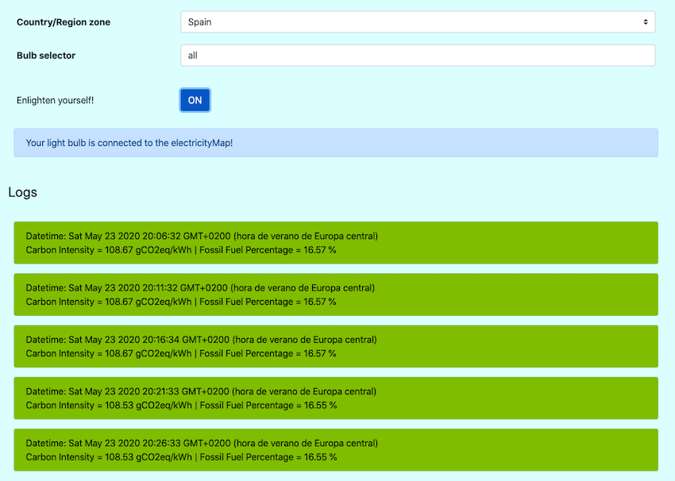

# EnlightenMe

_(Disclaimer: [This tweet](https://twitter.com/obauma/status/1220624748062953472?ref_src=twsrc%5Etfw%7Ctwcamp%5Etweetembed%7Ctwterm%5E1220624748062953472&ref_url=https%3A%2F%2Fwww.tmrow.com%2Fblog%2F5-climate-myths-that-need-to-die%2F)
from Olivier Baumann from [Tomorrow](https://www.tmrow.com/) inspired me to start this project)_

A simple tool that turns the [LIFX](https://eu.lifx.com/) light bulb greener when the sun shines or the wind blows 
(amongst others) in your region, and redder when they don't. Information about the carbon intensity of your region
is given by the [electricityMap](https://www.electricitymap.org/map). This tool informs us about the right moment 
to charge or use our electrified devices via a smart light bulb.

You can see a demo of it in action below. On the left side of the screen, there is the bulb, in the middle the **EnlightenMe**
app and on the right, the electricityMap. (Click on the image to play it on Youtube)

[](https://youtu.be/uwskfGy-IjY)


### Architecture

The app architecture has basically two elements:

* A web server built in Python with Flask containerized in a Docker image. This server is in charge of making
API calls to both the [LIFX API](https://api.developer.lifx.com/) and the [CO2 Signal API](https://docs.co2signal.com/).
The LIFX API allows us to easily update the status of our lightbulbs with HTTP requests. The CO2 Signal API
lets us extract information about the carbon intensity (in gCO2eq/kWh) of certain regions in real-time from the
electricityMap.

* A super lightweight web page built with plain HTML, CSS and Javascript. This web page makes requests iteratively 
every 5 minutes to the web server to extract the data from the electricityMap, process it and make another request to
update the bulb color. This interaction enables us to follow the evolution of the carbon intensity in
the region we're interested in in real-time. It also permits to choose amongst all the zones existing in the 
electricityMap. Furthermore, it lets us choose which bulb/s to update with the carbon intensity information.




## Run it yourself locally!

### The bulb

First of all, you'll need a LIFX light bulb. They are a bit pricey, but their API is really good and they work very well.
You can order them online [here](https://eu.lifx.com/).

If you have a different type of smart bulb, don't worry, just modify the url and headers of the HTTP request called in the
method *set_bulb_state* inside the [app.py](https://github.com/ericmassip/enlighten-me/blob/master/app.py) file according
to the specifications of your bulb API and you're good to go.

### Get the API keys

* You can generate a LIFX API token to connect to your bulbs [here](https://api.developer.lifx.com/docs/authentication). 
You'll need your LIFX account settings to ask for a token.

* You can generate a free (non-commercial use only) API key to get real-time data from the electricityMap [here](https://docs.co2signal.com/).

Edit the [env.py](https://github.com/ericmassip/enlighten-me/blob/master/env.py) file and place your API keys in there.

```python
LIFX_API_TOKEN = '<YOUR-LIFX-TOKEN-HERE>'
CO2_SIGNAL_TOKEN = '<YOUR-CO2-SIGNAL-API-KEY-HERE>'
```

### Start the web server

Clone the repository:

```shell script
git clone https://github.com/ericmassip/enlighten-me.git
```

Build the Docker image with the following command:

```shell script
docker build -t enlighten-me:latest .
```

Run it:
```shell script
docker run --rm -p 5000:5000 enlighten-me
```

### Open the webpage

This is a static web page so you just have to open the [index.html](https://github.com/ericmassip/enlighten-me/blob/master/web-app/index.html)
file on your browser.

## Contribute

If you modify a bit the app to enable it to work for your specific type of bulb, please feel free to submit a PR, it 
will be greatly appreciated. Thank you! 


